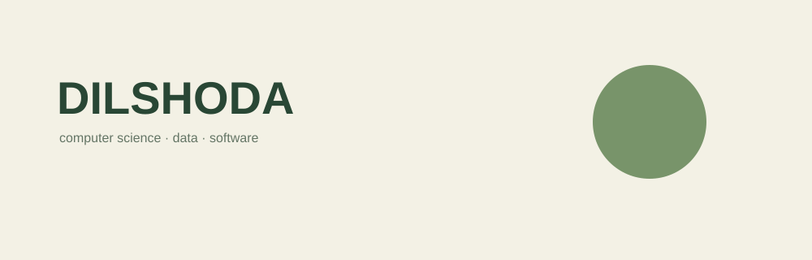

<div align="center">
  
</div>

# `whoami`

> 🌲 **CS student · builder · explorer**

Third-year Computer Science student exploring the intersection of
**data, systems, AI, game development, and hardware.**

I like turning curiosity into things I can actually **build, break, understand, and rebuild.**

`current_mode: exploring`

---

## `player.stats`

|                |                                        |
| -------------- | -------------------------------------- |
| 🎓 Class       | Computer Science                       |
| 🌱 Level       | 03                                     |
| 🧭 Mode        | Exploring                              |
| 🗺️ Main areas | Data · Systems · AI · Games · Hardware |
| 🌲 Theme       | Real-world & green tech                |

---

## `world.map`

```text
                         🌲 DIGITAL WORLD

                              [ YOU ]
                                │
                 ┌──────────────┼──────────────┐
                 │              │              │
                 ▼              ▼              ▼
              🗄️ DATA         🤖 AI         🔧 HARDWARE
                 │              │              │
                 └──────────────┼──────────────┘
                                │
                                ▼
                           🎮 GAME DEV
                                │
                                ▼
                         🌎 REAL WORLD
                                │
                                ▼
                         🌲 GREEN TECH
```

> I'm not trying to master every path at once.
> I'm exploring the intersections and seeing what I can build.

---

## `quests/`

### 🟢 `active`

* 🗄️ Build real **data pipelines**
* 🧠 Strengthen **DSA & system design**
* 🎮 Explore **game development**
* 🔧 Build with **hardware & sensors**

### 🟡 `side_quests`

* 🤖 Machine Learning
* 🌐 Backend & APIs
* ☁️ Cloud & scalable systems
* 🌱 Technology connected to nature and sustainability

### 🔒 `locked`

> There are still worlds I haven't discovered.

---

## `inventory/`

### 🧰 `tools`

`Git` · `GitHub` · `Linux` · `Docker`

### ⚔️ `languages`

`Python` · `Java` · `C#` · `SQL`

### 🧠 `abilities`

`OOP` · `Backend` · `APIs` · `Data` · `Problem Solving`

### 🔮 `currently_unlocking`

`Data Engineering` · `System Design` · `Game Development` · `Embedded Systems`

---

## `projects/`

> Things I've built, experimented with, and am still figuring out.

|     | Project          | What it is                                          | Stack                             |   Status   |
| :-: | ---------------- | --------------------------------------------------- | --------------------------------- | :--------: |
|  🌱 | **Portfolio**    | My corner of the internet                           | `HTML` `CSS` `JS`                 | `building` |
|  🌿 | **MU Blog**      | A social platform built for my university community | `.NET` `EF Core` `SQLite` `React` | `building` |
|  🔒 | **Data Project** | Coming soon                                         | `Python` `SQL`                    |  `locked`  |
|  🔒 | **Game**         | Something is growing here                           | `C#` `Unity`                      |  `locked`  |
|  🔒 | **Hardware**     | A small experiment with the physical world          | `Arduino` `...`                   |  `locked`  |

> `projects/` grows as I build. No placeholders stay forever.

---

## `learning/`

```text
📚 university/
├── DSA
├── OOP
├── Networks
├── Mobile Development
└── Game Development

🧪 self-study/
├── Data Engineering
├── System Design
├── Machine Learning
├── Game Development
└── Hardware
```

> University gives me the foundations.
> Side quests teach me what I want to do with them.

---

## `achievements/`

* 🎓 **Millat Umidi University** — Computer Science
* 🏅 **Academic Excellence Scholarship**
* 👩‍🏫 **SAT Math Support Teacher**
* 🌍 **IT Community Uzbekistan** — Core Team
* 🤝 **UnityCares** — Founder
* 🧪 **ML / Research** — exploring applied machine learning

---

## `current.mission`

```text
┌───────────────────────────────────────────────┐
│                                               │
│   BUILD MORE.                                │
│   PLAN LESS.                                 │
│                                               │
│   Turn curiosity → experiments → systems.    │
│                                               │
└───────────────────────────────────────────────┘
```

---

## `philosophy`

> I don't want to collect technologies just to say I know them.
> I want to build things that make learning them necessary.

`status: still exploring... 🌲`

---

### `connect/`

[GitHub](https://github.com/) · [LinkedIn](YOUR_LINK) · [Email](mailto:YOUR_EMAIL)
