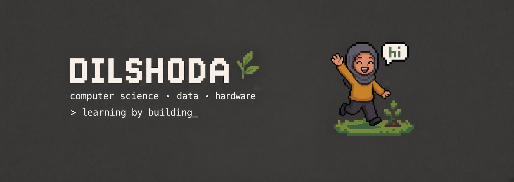

  

# `whoami`

  

third-year computer science student exploring **data, hardware, game development, and ai.**

**build, break, understand, and rebuild.**

---

## `datacamp/`

> data engineering track progress & continuous learning log.

| skill / module | core technologies | exercises & notebooks | status |
| :--- | :--- | :--- | :--- |
| **data engineering fundamentals** | python, sql, airflow | [`etl_pipeline.py`](https://github.com/shoda06) | `in progress` |
| **database design & management** | postgresql, relational db | [`schema_design.sql`](https://github.com/shoda06) | `completed` |
| **data manipulation & analytics** | pandas, numpy | [`data_analysis.ipynb`](https://github.com/shoda06) | `completed` |

---

## `academics/`

> university computer science coursework and laboratory assignments.

| course / module | lab commits | 
| :--- | :--- | :--- | :--- |
| **Web Application** | [lab tasks](https://github.com/shoda06/web-development-labs) | 
| **Mobile Application** | [assignments](https://github.com/shoda06) |
| **Game Development** | [projects](https://github.com/shoda06) | 
| **Operating Systems** | [lab tasks](https://github.com/shoda06) |
| **System Adminstration** | [assignments](https://github.com/shoda06) |

---

## `skills/`

### ⚔️ languages
`python` · `kotlin` · `java` · `C#` · `html/css` · `sql`   

### 🧰 tools & platforms
`git/github` · `cisco packet tracer` · `mysql` · `linux`

### 🧠 abilities
`<exploring->developing>`

---

## `projects/`

- **[mu blog platform](https://www.mu-blog.uz/)** — academic student blog platform ~ community engagement for students.

---

## `achievements/`
`<exploring->developing>`
  
---

## `philosophy/`

> *"i don't know yet, but i will learn and contribute to mission-driven projects."*
---

## `connect/`

  
  
  

